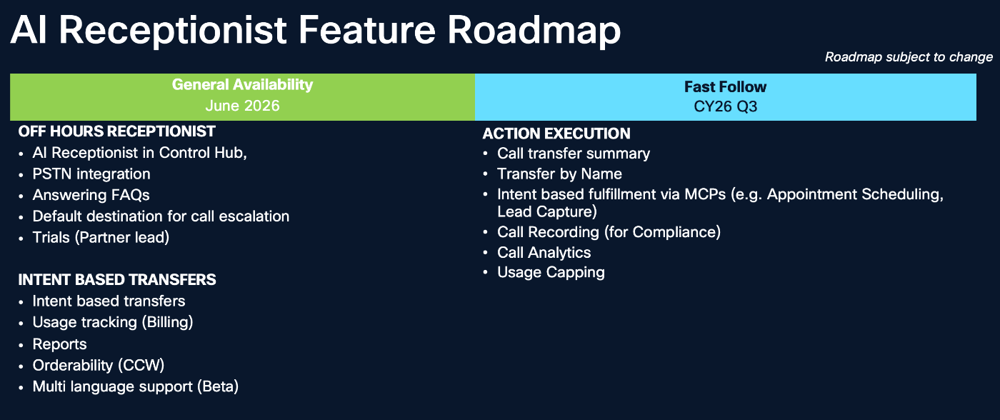
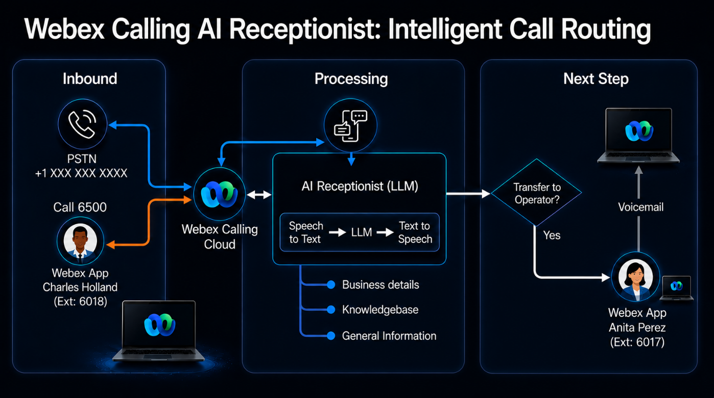

# AI Receptionist for Webex Calling

Cisco Live Melbourne · LTRCOL-2651 · Hussain Ali, Technical Marketing Engineer

Configure an AI Receptionist, build its knowledge base, route callers to support teams, and test the complete experience.

**Guide date:** November 12, 2026 · **Estimated lab time:** 74 minutes

[Start Task 1 →](tasks/01-access-the-lab.md){ .md-button .md-button--primary }

!!! info "Before you start"

    Have your assigned dCloud session available. Use your own session’s domain, credentials, and PSTN numbers wherever the guide shows examples. Tasks 4–6 require the Customer Assist queues and user roles described in the guide to exist in your lab.

    Your instructor provides a separate private credentials handout. Login details are intentionally omitted from this public website.

## Learning Objectives \[1 minute\] { #learning-objectives-1-minute }

Upon completion of this lab, you will:

- Have fundamental knowledge of <strong>AI Receptionist for Webex Calling</strong>. Their key capabilities, how to configure them and how they work.

- How to configure an AI Receptionist along with its knowledge base and interact with the AI Receptionist to see the experience

## Scenario \[3 minutes\] { #scenario-3-minutes }

In this lab, you will gain hands-on experience in configuring and testing the <strong>AI Receptionist.</strong> This lab provides step-by-step instructions for setting up an AI Receptionist.

Here are the high-level TASKS to achieve the objectives of this lab:

- [TASK 1: Accessing the lab](tasks/01-access-the-lab.md)

- [TASK 2: Access the Collaboration Control Hub](tasks/02-control-hub.md)

- [TASK 3: Configure an AI Receptionist](tasks/03-configure-ai-receptionist.md)

- [TASK 4: Configure intent-based routing for the AI Receptionist](tasks/04-intent-based-routing.md)

- [TASK 5: Log into the Webex App for all users](tasks/05-webex-app.md)

- [TASK 6: Verify and interact with the AI Receptionist](tasks/06-verify-ai-receptionist.md)

## Lab Topology \[5 minutes\] { #lab-topology-5-minutes }

The lab already has the Unified Communications Manager and Unity Connection with preconfigured users and devices.

![Lab Topology [5 minutes] — screenshot 1](assets/images/image6.jpg){ .lab-screenshot width="668" loading="lazy" }

Table 1 - Lab Details

| <strong>Application</strong> | <strong>Version</strong> | <strong>IP address or URL</strong> |
| --- | --- | --- |
| Cisco Unified CM | 14.x | 198.18.133.3 |
| Unity Connection | 14.x | 198.18.133.5 |
| User Workstation 1 | Windows 10 | 198.18.1.36 |
| User Workstation 2 | Windows 10 | 198.18.1.37 |
| User Workstation 3 | Windows 10 | 198.18.1.35 |
| User Workstation 4 | Windows 10 | 198.18.1.40 |
| Cisco CSR8000v (LGW) | 17.13.1a | 198.18.133.227 198.18.1.227 |
| Collaboration Control Hub |  | [https://admin.webex.com](https://admin.webex.com) |

Table 2 - User Details

| <strong>User</strong> | <strong>Directory Number</strong> | <strong>Webex Calling Enabled</strong> |
| --- | --- | --- |
| Adam McKenzie | 6016 | N |
| Anita Perez | 6017 | <strong>Y</strong> |
| Charles Holland | 6018 | <strong>Y</strong> |
| Eric Steele | 6099 | N |
| Kellie Melby | 6050 | <strong>Y</strong> |
| Monica Cheng | 6020 | N |
| Rebekah Barretta | 6088 | N |
| Ricardo Filice | 6083 | N |
| Stefan Mauk | 6072 | N |
| Taylor Bard | 6026 | <strong>Y</strong> |

!!! note

    Obtain your assigned login details privately using [Task 1: Accessing the Lab](tasks/01-access-the-lab.md). Credentials are intentionally omitted from this public guide.

## AI Receptionist Overview \[5 minutes\] { #ai-receptionist-overview-5-minutes }

In this part of the lab, you will gain hands-on experience in modernizing front-desk operations using the Webex Calling AI Receptionist. As businesses face increasing pressure to balance high-quality customer service with limited staffing and budget constraints, AI-driven automation has become a critical tool for operational efficiency.

The lab provides a comprehensive walkthrough of the AI Receptionist deployment lifecycle within the Collaboration Control Hub. You will move from the basic call routing via Auto Attendants to using an intelligent, LLM-powered capable AI Receptionist that understands the caller’s intent, provides context-aware information, and routes calls to the right Customer Assist queue or user.

![AI Receptionist Overview [5 minutes] — screenshot 2](assets/images/image33.png){ .lab-screenshot width="864" loading="lazy" }

Even after-hours customers can get answers to important questions:

- What services do they offer?

- Do they have warranties?

- What are the office hours?

- Can I schedule an appointment for a service call?

Traditionally customers would have to wait until the next business day to get answers. This delay can be frustrating and may even lead customers to looking elsewhere for help.

Instead of hitting a dead end, the customer can be greeted by an AI Receptionist, a smart, conversational assistant available 24/7. This AI Receptionist can:

- Answer questions about services

- Answer questions about products supported

- Provide general pricing information

- Share information about warranties you offer

- Help understand office hours and scheduling service calls

- Guide you toward booking an appointment

All of this happens instantly during normal business hours as well as outside business hours. Calls can be answered, questions can be answered, and callers can be transferred to an operator or a queue to get the help they need.

Why This Matters:

- An AI Receptionist isn’t just a convenience—it’s a powerful tool that helps businesses:

- Never miss a customer inquiry

- Provide instant support around the clock

- Reduce workload on human staff

- Deliver a modern, responsive customer experience

### Roadmap { #roadmap }

{ .lab-screenshot width="611" loading="lazy" }

### What You Will Build in This Lab: { #what-you-will-build-in-this-lab }

In this lab, you will configure your own AI Receptionist for a Cisco collaboration consulting firm.

{ .lab-screenshot width="611" loading="lazy" }

You will configure the AI Receptionist so that when a “customer” interacts with it the AI Receptionist provides confident answers to questions and guides them effectively to the correct resource who can help them. You are creating the first point of contact for a customer.

This part of the lab is divided into two sections:

<strong>Step 1 – AI Receptionist Configuration</strong>

- Configure the AI Receptionist and operational guidelines

- Build and populate the AI Receptionist Knowledge Base

<strong>Step 2 – Add intent-based routing and Validate caller interactions and call routing</strong>

- Define and map intent-based call routing

- Login to the Webex App

- Make test calls

- Validate the AI Receptionist workflow and call escalation
