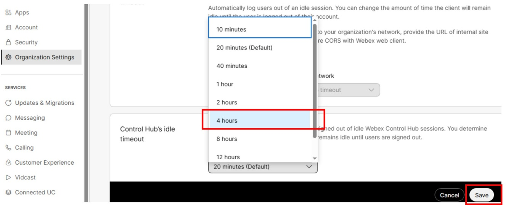
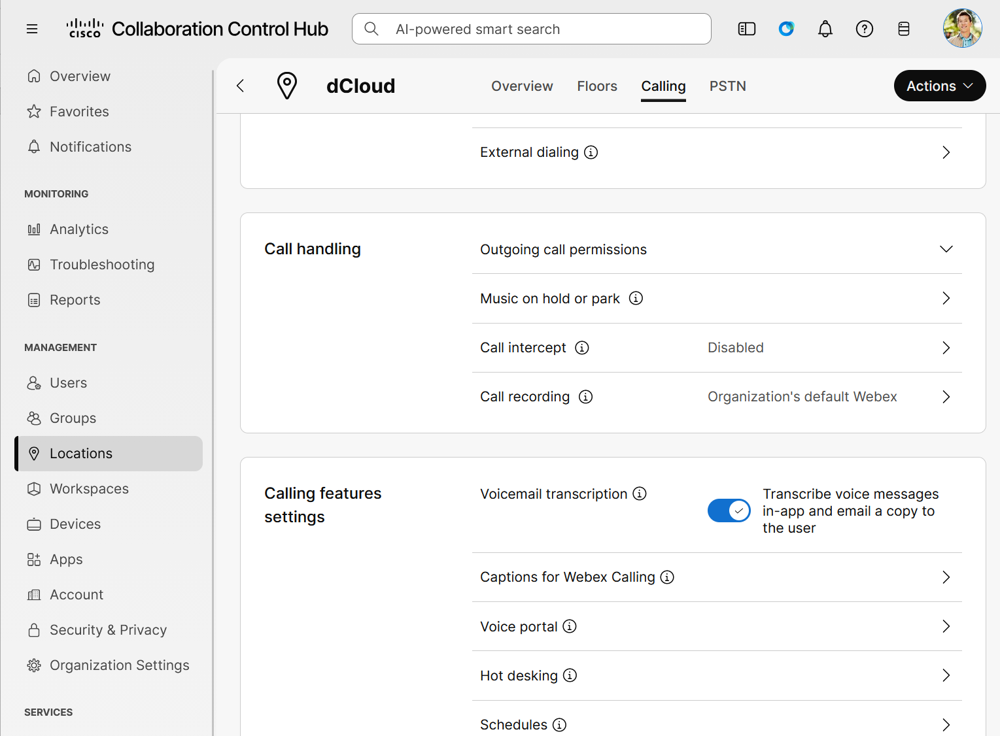

# Task 2: Access Collaboration Control Hub \[3 minutes\] { #task-2-access-collaboration-control-hub-3-minutes }

## Step 1: Login to Control Hub { #step-1-login-to-control-hub }

1. Launch the Chrome browser from <strong>Workstation 1</strong> and the home page will show the available quick links in your assigned session. If the browser is already open you can open a new tab.

2. Click on “<em>Cisco Webex Links \> Cisco Webex Control Hub</em>”. The username and password shown under “Cisco Webex Control Hub” will be used to log in (or refer back to your notes from <strong>Task 1 – Accessing the Lab</strong>).

3. On the Webex Control Hub login page, login using Charles Holland’s Webex credentials.

!!! note

    Use your assigned Charles Holland account. See [Task 1, Step 3](01-access-the-lab.md#step-3-login-credential-for-control-hub-and-webex-app) to locate credentials privately.

4. Accept any pop-up messages you see when you log-in for the first time.

## Step 2: Change Control Hub idle timeout { #step-2-change-control-hub-idle-timeout }

1. Under <strong>Management</strong>, click on “<em>Organization Settings</em>”

2. Scroll down until you can see “<strong>Control Hub’s idle timeout</strong>”

3. Change the value from 20 minutes (Default) to “<em>4 hours</em>” or longer

    { .lab-screenshot width="579" loading="lazy" }

4. Click “<em>Save</em>”

## Step 3: Display Resolution { #step-3-display-resolution }

If your laptop has limited resolution (e.g. 1440x900), you can zoom out to 80% (<em>Ctrl -</em>) to have a better view of the screen content for the rest of this lab. Most laptops do not need this.

## Step 4: Verify/Configure Voicemail Settings { #step-4-verifyconfigure-voicemail-settings }

1. In this lab you will be transferring some calls to a user’s voicemail. You will use <strong>Anita Perez’s</strong> voicemail box, which will simulate calls being routed to the human operator or agent.

2. Go to “<em>Locations \> dCloud \> Calling \> Calling features settings</em>”. Click on the “<em>Voice Portal</em>” setting.

{ .lab-screenshot width="864" loading="lazy" }

3. On the <strong>Voice Portal</strong> page go to ‘<em>Incoming Call \> Phone Number</em>’, enter extension “6600” and click ‘<em>Save’</em>.

<strong>This task is now completed. Proceed to the next task.</strong>
