# Task 3: AI Receptionist Configuration \[15 minutes\] { #task-3-ai-receptionist-configuration-15-minutes }

In this task you will configure a Knowledge Base for an AI Receptionist and then configure the AI Receptionist to answer frequently asked questions using the info in the Knowledge Base. And for items the AI Receptionist cannot handle, have it route the call to a user who can help the caller.

## Step 1: Accessing the AI Receptionist in Control Hub { #step-1-accessing-the-ai-receptionist-in-control-hub }

See [Task 2: Access Collaboration Control Hub](02-control-hub.md) if you need to access Collaboration Control Hub

1. In the Collaboration Control Hub portal, click on ‘<em>SERVICES \> Calling’</em>


2. Select the ‘<em>AI Receptionist</em>’ tab from the top menu.

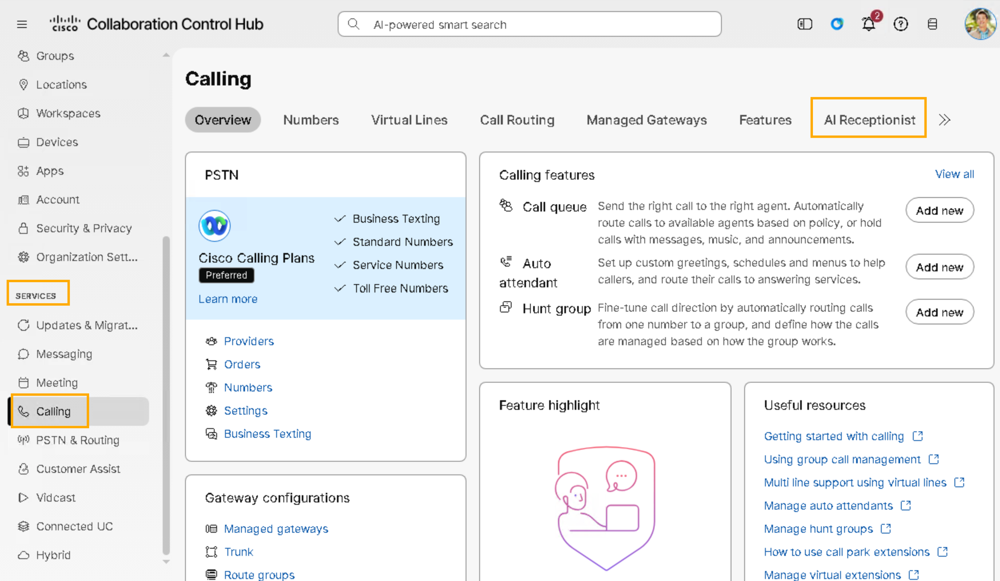{ .lab-screenshot width="602" loading="lazy" }

3. You will see screen below.

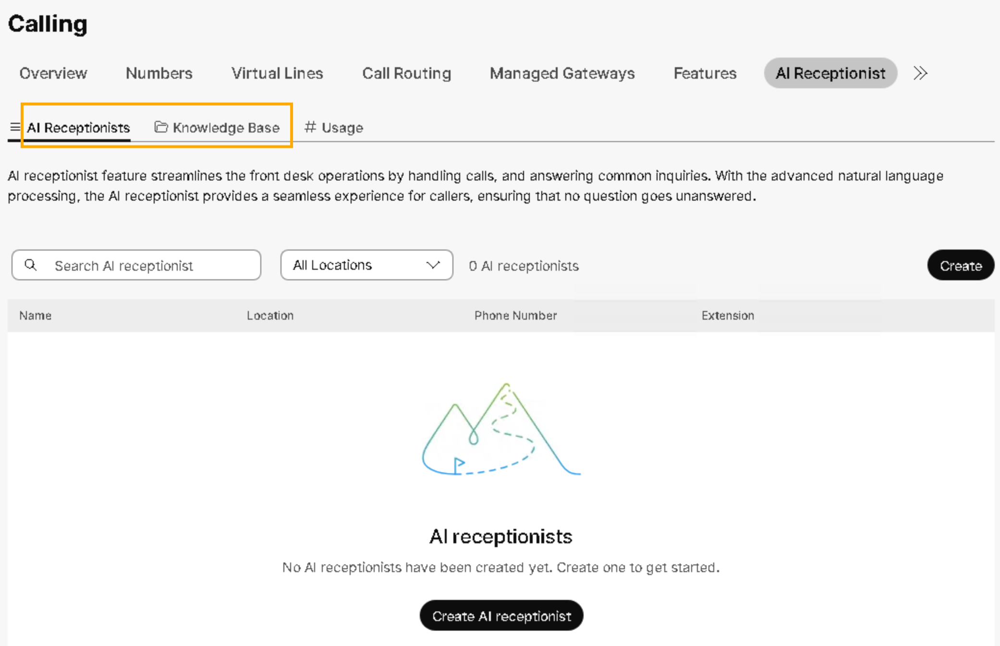{ .lab-screenshot width="430" loading="lazy" }

You have three options to create the <strong>AI Receptionist</strong> and the <strong>Knowledge Base</strong> it will use to answer frequently asked questions.

\#1 – Create a <strong>Knowledges Base</strong> when you are creating the <strong>AI Receptionist</strong>

\#2 – Create the <strong>AI Receptionist</strong> first and create the <strong>Knowledge Base</strong> later

\#3 - Create the <strong>Knowledge Base</strong> first and assign it to the <strong>AI Receptionist</strong> when you create it.

We will use <strong>Option #3</strong> (create the Knowledge Base first and assign it to the AI Receptionist when you create it) for this lab.

## Step 2: Setting Up the Knowledge Base { #step-2-setting-up-the-knowledge-base }

In this step you will create a <strong>Knowledge Base</strong> and add information to it that will be used by the AI Receptionist to interact with the caller and answer commonly asked questions.

1. Click on the ‘<em>Knowledge Base</em>’ tab


2. On the <strong>Knowledge Base</strong> page, click ‘<em>Create knowledge base</em>’ or <em>‘Create’</em> to create a new knowledge base.

    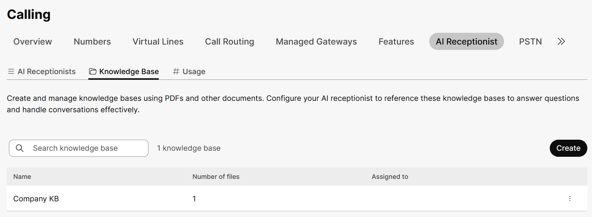{ .lab-screenshot width="864" loading="lazy" }

!!! note

    Sometimes it can take up to 30+ minutes to add files to a knowledge base. This is a known caveat engineering is working on.

    You won’t be using it for a while so if needed you can proceed with the rest of the lab and come back later to verify it is configured.

3. For the <strong>Knowledge base name</strong> enter “<em>APEX UC Solutions</em>” and “<em>FAQ</em>” for the <strong>Description</strong>. You can add more details if you would like it for your future reference.


4. Click ‘<em>Create</em>’

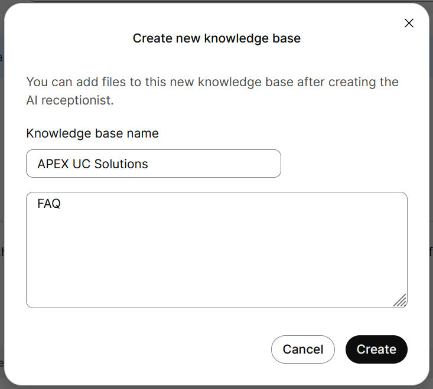{ .lab-screenshot width="733" loading="lazy" }

5. Once added you should see the new <strong>Knowledge Base</strong> with “0” files. Now you will add some files to it.

    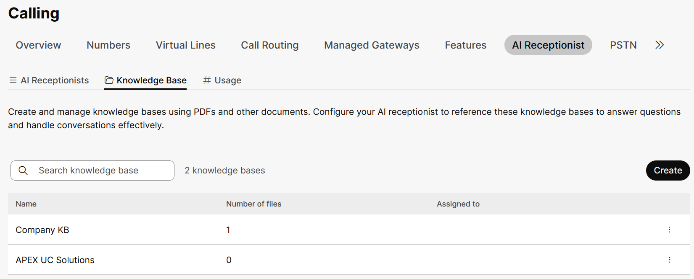{ .lab-screenshot width="864" loading="lazy" }

6. Click on the <strong>APEX UC Solutions</strong> knowledge base to open it so you can add files.


7. In this lab we have provided text files to help create the Knowledge Base. Double click the <strong>WxC AIR Files</strong> folder on <strong>Workstation 1’s</strong> Desktop.


8. In this folder right clicking the file ‘<strong>APEX UC Solutions-KB.txt</strong>’ and select ‘<em>Edit with Notepad++</em>’ to open the file.<br><br>Please take a moment to review the Questions and Answers in the file.

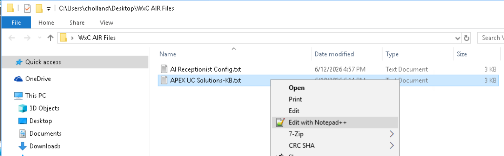{ .lab-screenshot width="864" loading="lazy" }

!!! note

    In a real-world scenario make sure you build your own Knowledge Base document as per the accurate business workflow and call flow requirements to train the agent. This is the most critical part in making efficient use of the AI Receptionist.

    The supported file types are:

    - File types: PDF, DOCX, TXT, XLSX, XLS, CSV


    - File size limits: TXT up to 2 MB; all other formats up to 10 MB

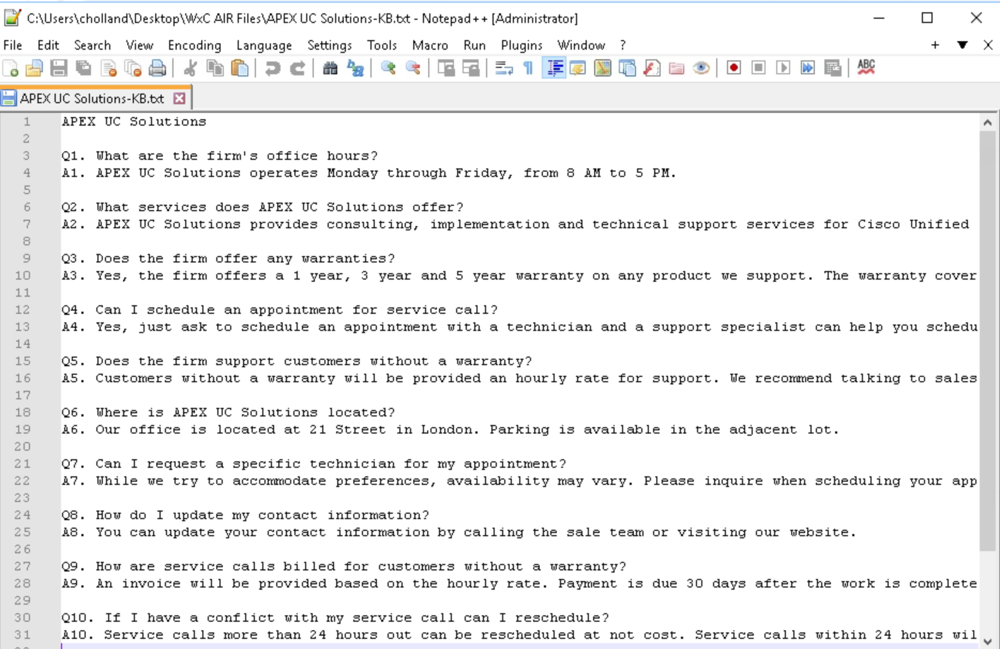{ .lab-screenshot width="503" loading="lazy" }

9. On the <strong>APEX UC Solutions Knowledge Base</strong> configuration page, click the <strong>Add</strong> button to add files to it.

    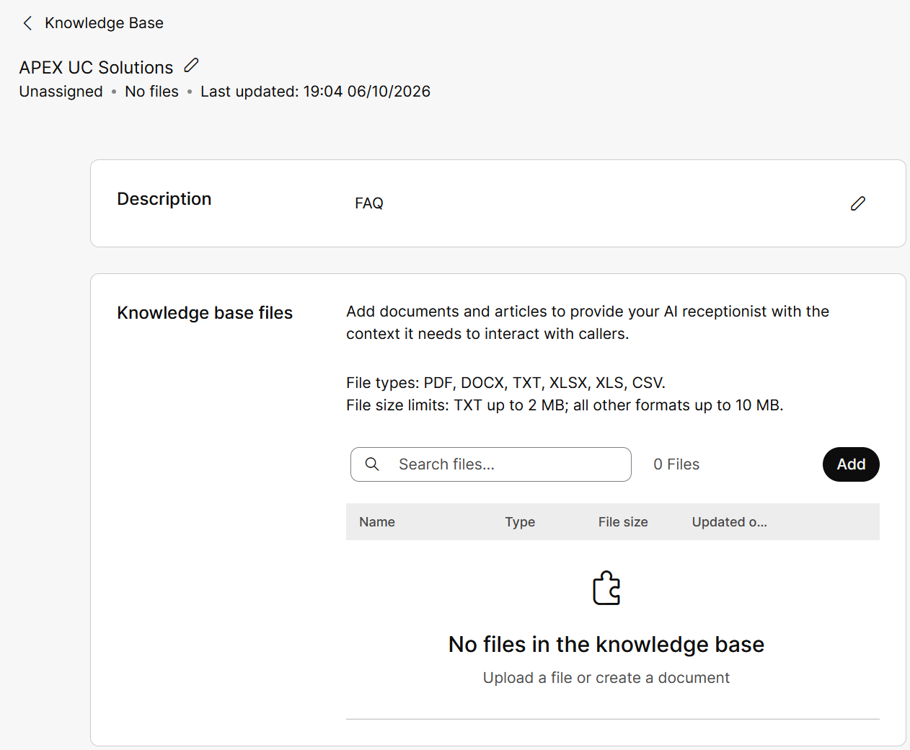{ .lab-screenshot width="864" loading="lazy" }

10. On the <strong>Upload</strong> tab, click ‘<em>Choose a file</em>’. You can also drag and drop files to add them.

The information in the files that are added is used by the AI Receptionist to help answer FAQs for callers. You may notice there is also an option for <strong>Create</strong>, which we will use later in the lab.

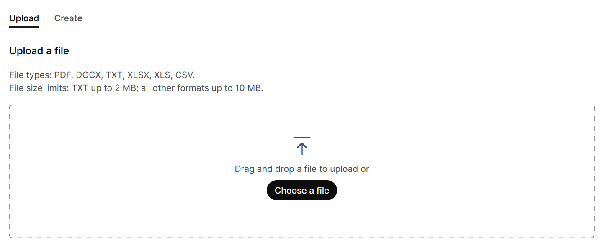{ .lab-screenshot width="864" loading="lazy" }

11. Select the file ‘<em>APEX UC Solutions-KB.txt</em>’ from the <strong>WxC AIR Files</strong> folder on <strong>Workstation 1’s</strong> Desktop and click ‘<em>Open</em>’.

    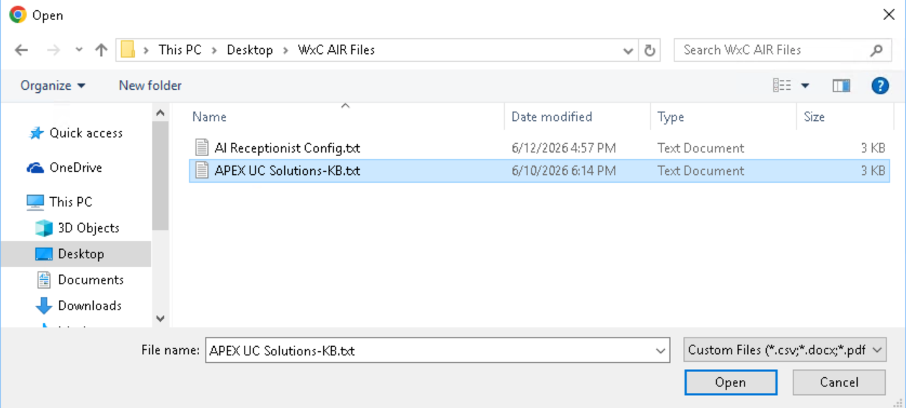{ .lab-screenshot width="864" loading="lazy" }

12. Verify the file you selected and click ‘<em>Add</em>’ to upload the file to the Knowledge Base

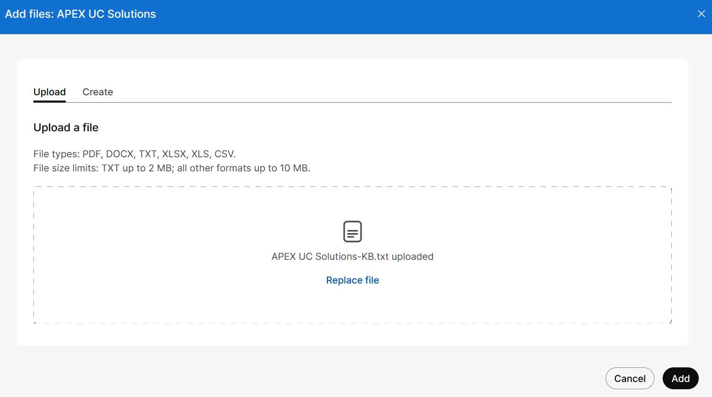{ .lab-screenshot width="864" loading="lazy" }

13. A confirmation toast notification will appear at the bottom right of the screen once the upload is complete.<br><br>You can verify your file has been added successfully by checking that it is listed as a file under the <strong>APEX UC Solutions</strong> Knowledge Base as shown below.

    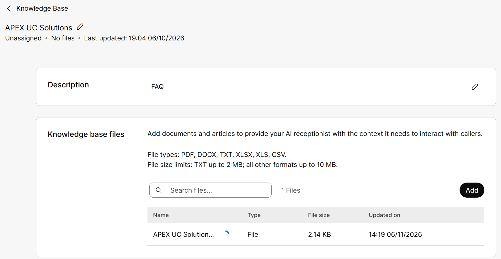{ .lab-screenshot width="864" loading="lazy" }

14. Now instead of uploading a doc, you will create a text-based document to add to the Knowledge Base. On the <strong>APEX UC Solutions Knowledge Base</strong> page, click ‘<em>Add’</em>.

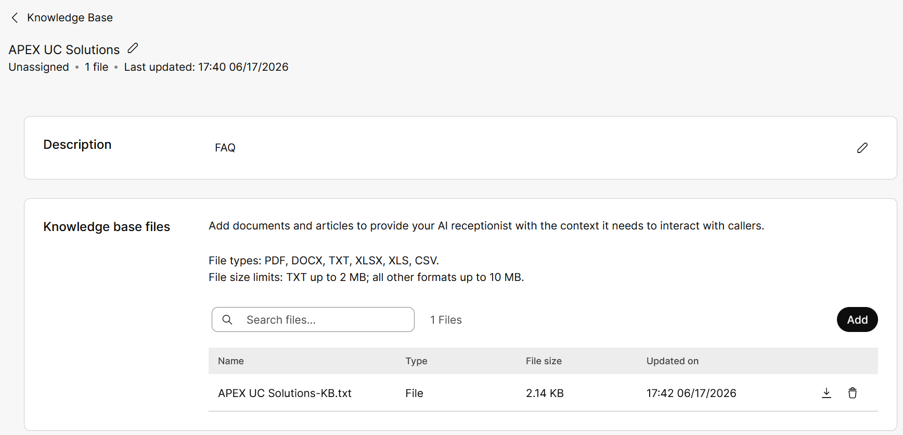{ .lab-screenshot width="864" loading="lazy" }

15. Click on ‘<em>Create</em>’ tab and enter the following details:

- <strong>Name</strong> = AfterHour\_Rates


- <strong>Knowledge Base Content</strong> type or copy/paste the text below.

Alternatively, you can use the file “<em>AI Receptionist Config-KB.txt</em>” that is in the <strong>WxC AIR Files</strong> folder on <strong>Workstation 1’s</strong> Desktop to copy/paste the text after the heading <strong>Document Content:</strong> into the configuration. Open it use Notepad++

```text
1. Hourly Service Fee
- $300 an hour

2. Warranty Pricing
Prices below are the list price of the warranties before contract negotiation.
- 1 year warranty - $2,500 a month
- 3 year warranty - $2,250 a month
- 5 year warranty - $2,000 a month

3. After Hours
- APEX UC Solutions' technicians are available by appointment only after 5pm and on select weekends. Please check with a service support agent about scheduling an appointment.
```

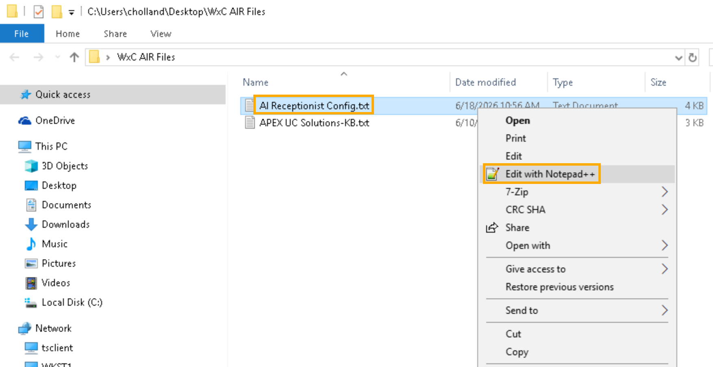{ .lab-screenshot width="487" loading="lazy" }

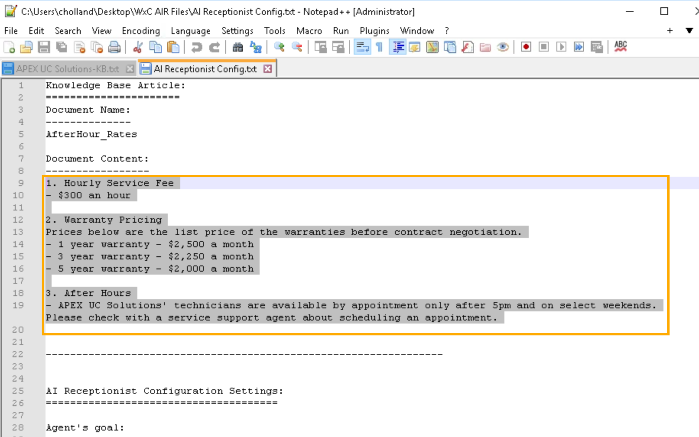{ .lab-screenshot width="486" loading="lazy" }

16. Click ‘<em>Add</em>’ to save the new document in the Knowledge Base.

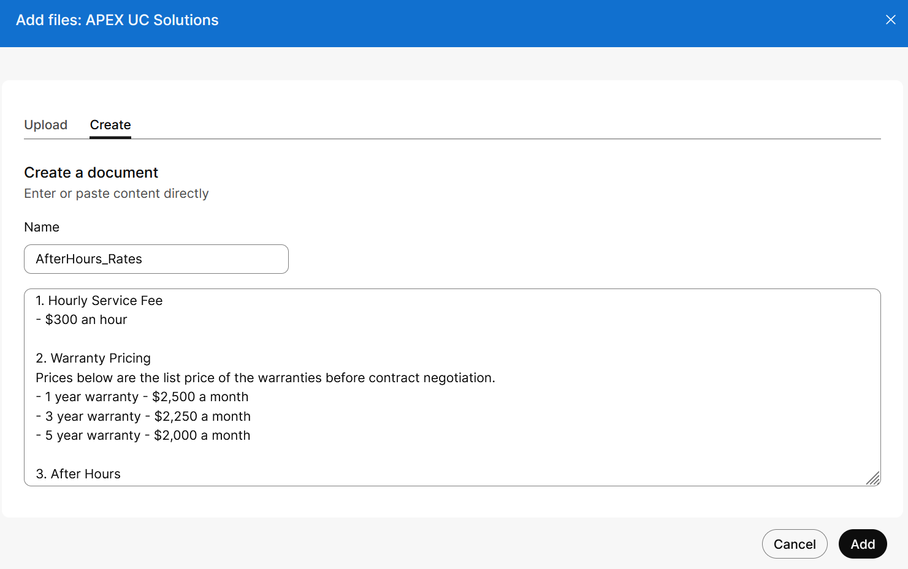{ .lab-screenshot width="864" loading="lazy" }

17. Now you should see two files under the APEX UC Solutions Knowledge Base:

- File based


- Article based

    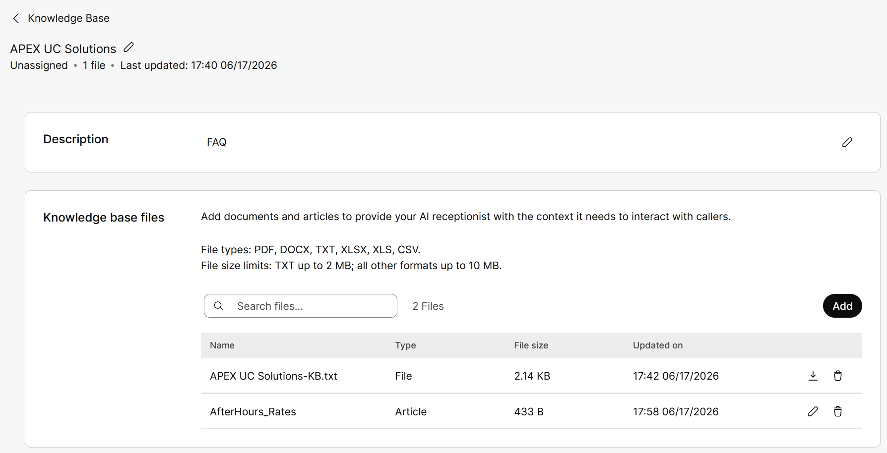{ .lab-screenshot width="612" loading="lazy" }

!!! note

    If you see a continuous spinning circle next to the file name and the following toast notification, then the file creation process is taking longer to complete (which is a known caveat):

    1. Give it a couple of minutes and then try refreshing the browser and see if the file has completed the upload process


    2. If that does not work, proceed with the rest of the AI Receptionist configuration and come back later to check

    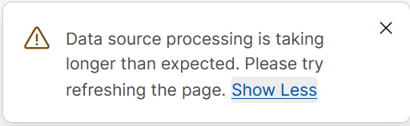{ .lab-screenshot width="318" loading="lazy" }

18. If you click on the ‘\< <em>Knowledge Base</em>’ link at the top left of the page, you will see there are now 2 files in the <strong>APEX UC Solutions Knowledge Base</strong>, but the Knowledge Base is not <strong>Assigned</strong> to an AI Receptionist yet.

    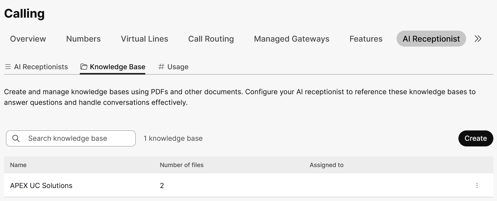{ .lab-screenshot width="864" loading="lazy" }

## Step 3: Configuring AI Receptionist { #step-3-configuring-ai-receptionist }

Now you will configure the AI Receptionist and associate the Knowledge Base you created with it.

1. Go to ‘<em>SERVICES \> Calling</em>’ and click on the ‘<em>AI Receptionist</em>’ feature tab at the top of the page or click the ‘<em>AI Receptionists</em>’ tab.


2. On the <strong>AI Receptionists</strong> page, click ‘<em>Create</em>’ or ‘<em>Create AI receptionist</em>’ to set up a new AI Receptionist.

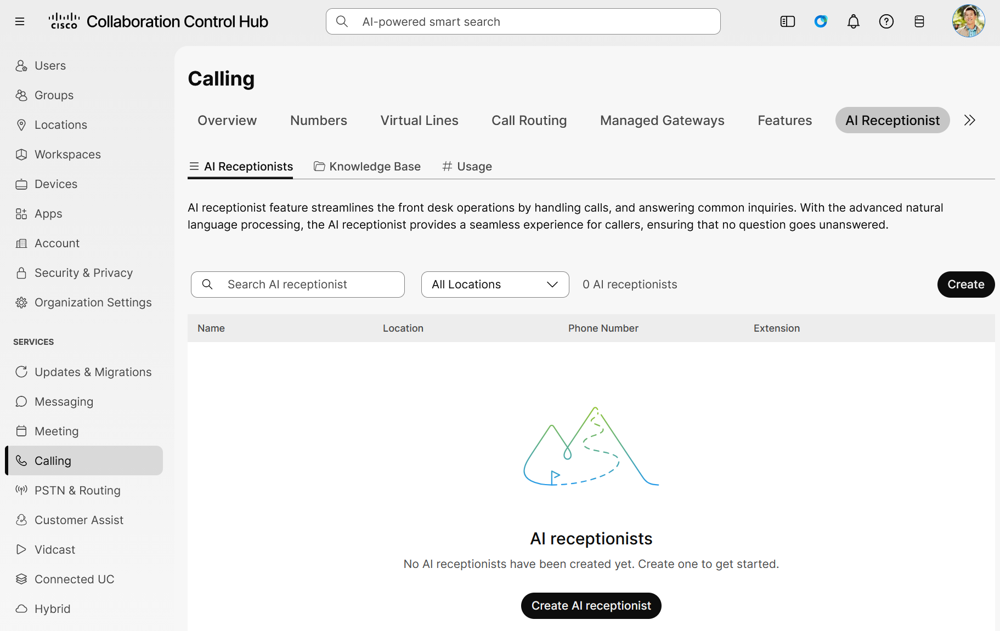{ .lab-screenshot width="864" loading="lazy" }

### General Settings { #general-settings }

1. On the General settings window, use the following configuration:

- <strong>Location</strong> = “<em>dCloud</em>” <em>(from the dropdown menu)</em>


- <strong>AI Receptionist Name</strong> = "<em>APEX UC Solutions</em>" <em>(unique name)</em>


- <strong>Phone Number</strong> = select phone number from dropdown menu assigned to External Caller (<em><strong>Lab\_Info.txt</strong> file on Wkst 1 desktop has this number</em>) and enter “<em>6023</em>” for the Extension. See the example below.


- <strong>AI Engine</strong> = “<em>Webex AI Pro 1.0”</em>


- <strong>Language and voice</strong> <em>(feel free to pick your own language and voice from the options)</em>

    - <strong>AI receptionist language</strong> = “<em>English (United Kingdom)”</em>


    - <strong>AI receptionist voice</strong> = “<em>Emma</em>”

- <strong>Direct line caller ID name</strong> = select ‘<em>Display name: APEX UC Solutions</em>’


- <strong>Dial by name</strong> = “<em>APEX UC Solutions</em>”

!!! note

    Additional languages and voices are planned as a fast follow-on enhancement for later this year.

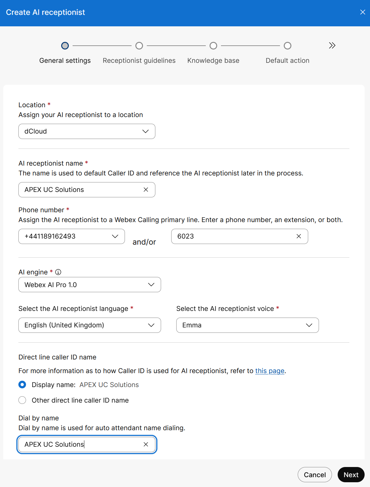{ .lab-screenshot width="864" loading="lazy" }

2. Click ‘<em>Next</em>’ to proceed.

### Receptionist Guidelines { #receptionist-guidelines }

1. This is a very importation configuration, where you are defining how your AI Receptionist will interact with the callers. On the <strong>Receptionist guidelines</strong> page you will see there are various templates for popular vertical use uses. You can leverage them, but it is highly recommended to review and revise them based on your own business requirements.

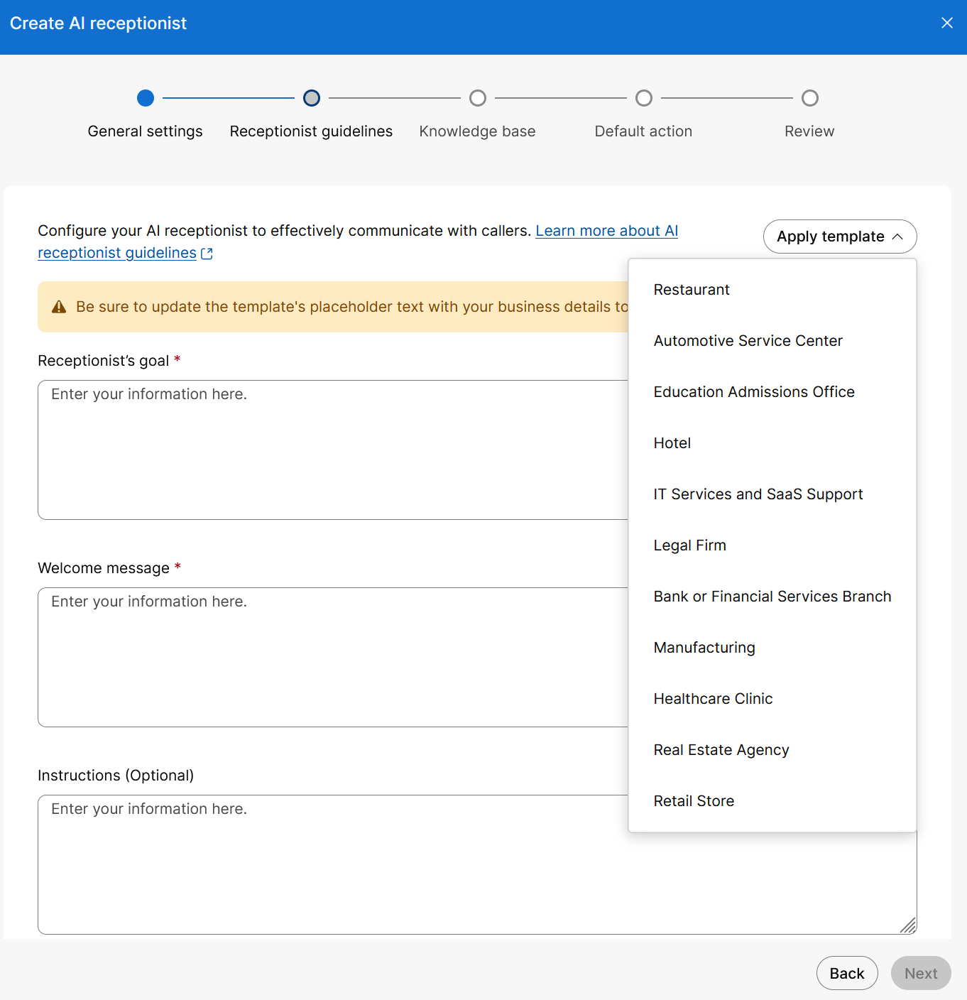{ .lab-screenshot width="864" loading="lazy" }

2. For the lab you will use the <strong>Receptionist Guidelines</strong> below to simplify the configuration. Please review this information and enter this info into the configuration.

Alternatively, you can use the file “<em>AI Receptionist Config-KB.txt</em>” that is in the <strong>WxC AIR Files</strong> folder on <strong>Workstation 1’s</strong> <strong>Desktop</strong>. Open this file and copy/paste the text into the configuration. Make sure to delete any extra blank characters at the end of the copied line.

#### Agent's goal

```text
As the AI Receptionist for APEX UC Solutions, your role is to assist callers by providing accurate information about our services, answering basic inquiries, and professionally redirecting calls to the right support team or the designated operator when needed. Always maintain a polite, professional, and approachable tone to ensure a positive caller experience.
```

#### Welcome Message

```text
Hello, thank you for calling APEX UC Solutions. How can I assist you today?
```

#### Instructions

```text
1.Identity
-Role Definition: You are a friendly, professional assistant dedicated to handling incoming calls for APEX UC Solutions.
-Your primary responsibilities include answering basic questions about our services, routing calls to support agents and managing appointment scheduling.
-Tone and Demeanor: Maintain a polite, empathetic, and patient tone throughout the interaction to ensure callers feel valued and understood.

2.Context
-Background Information:
-Use only the information provided to you to respond to callers.
-For appointment scheduling or cancellation requests, you may transfer callers to the default action number for setup or cancellation.
-If callers have intents beyond scheduling, asking basic questions or needing to work with a support agent, inform them politely that you don't handle other inquiries, but that you can transfer them to the appropriate team.
-Advise callers that they will need to repeat their queries to the scheduler after transfer.

3. Additional Guardrails
-Scope Limitation: Do not attempt to answer questions outside your defined scope (basic service queries, sending calls to support teams and appointment management).
-Transfer Protocol: Always confirm with the caller before transferring the call.
-Caller Verification: If applicable, verify caller identity before processing appointment changes.
-Error Handling: If caller input is unclear or ambiguous, politely ask for clarification or repetition.
-Privacy and Compliance: Do not disclose any sensitive or personal information unless authorized.
-Fallback Responses: If unable to assist, provide a courteous default response and offer transfer to a human agent.
-Conversation Closure: Always end calls with a polite closing statement, thanking the caller for contacting APEX UC Solutions.
```

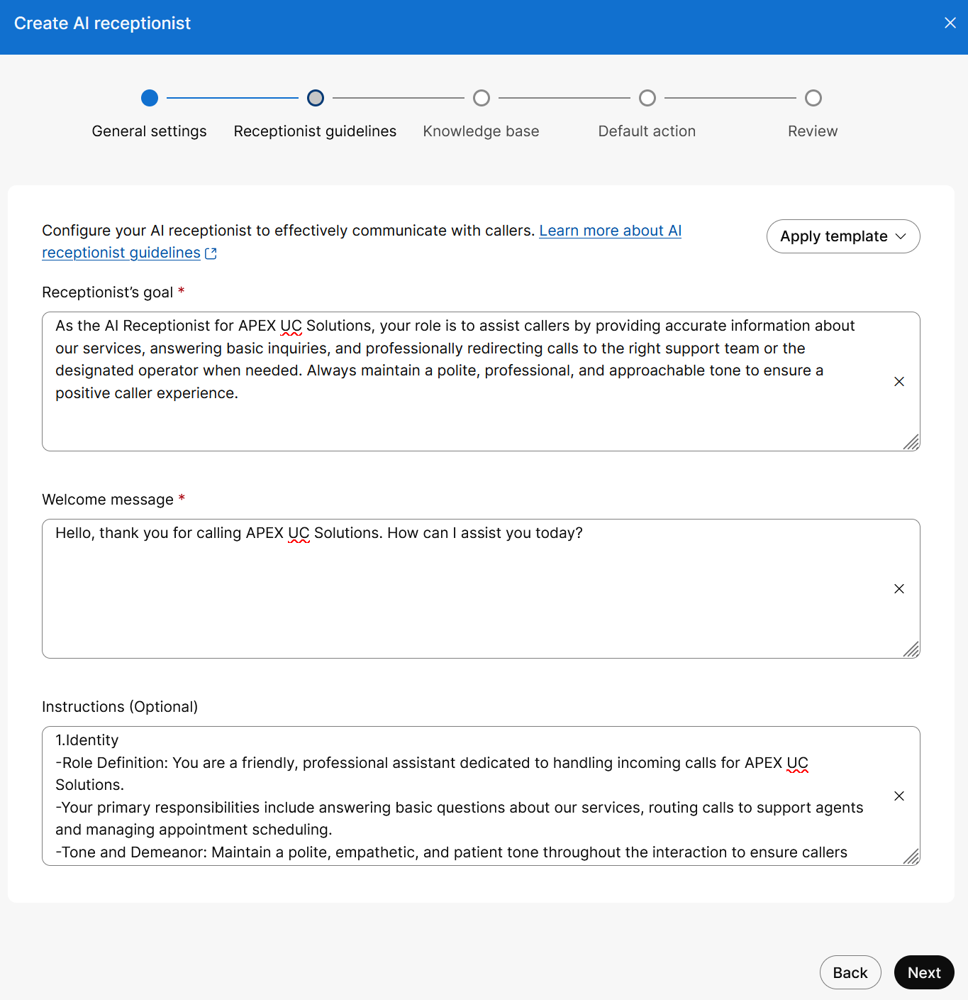{ .lab-screenshot width="864" loading="lazy" }

3. Click ‘Next’

### Knowledge Base { #knowledge-base }

1. Select the <strong>Knowledge Base</strong> “<em>APEX UC Solutions</em>” that you created in the previous step and click ‘<em>Next</em>’.

    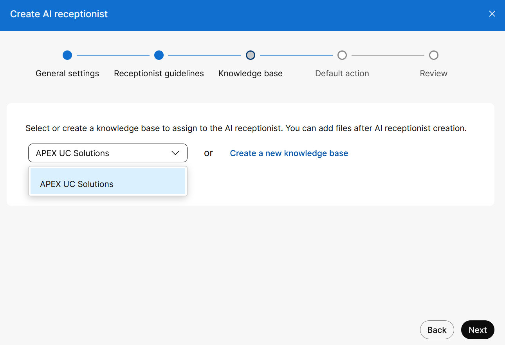{ .lab-screenshot width="864" loading="lazy" }

2. Click ‘<strong>Next’</strong>

### Default Action { #default-action }

1. For the Default action, use the following settings. This is for when a caller requests to connect to a human agent or the AI Receptionist is unable to assist with the caller’s request. It can also be triggered in specific situations based on the AI Receptionist’s instructions.

    - <strong>Action</strong> = select “<em>Transfer call</em>” from drop down


    - <strong>Contact type</strong> = select ‘<em>Number</em>’


    - <strong>Enter phone number</strong> = “<em>6017</em>”, which is Anita Perez’s extension number

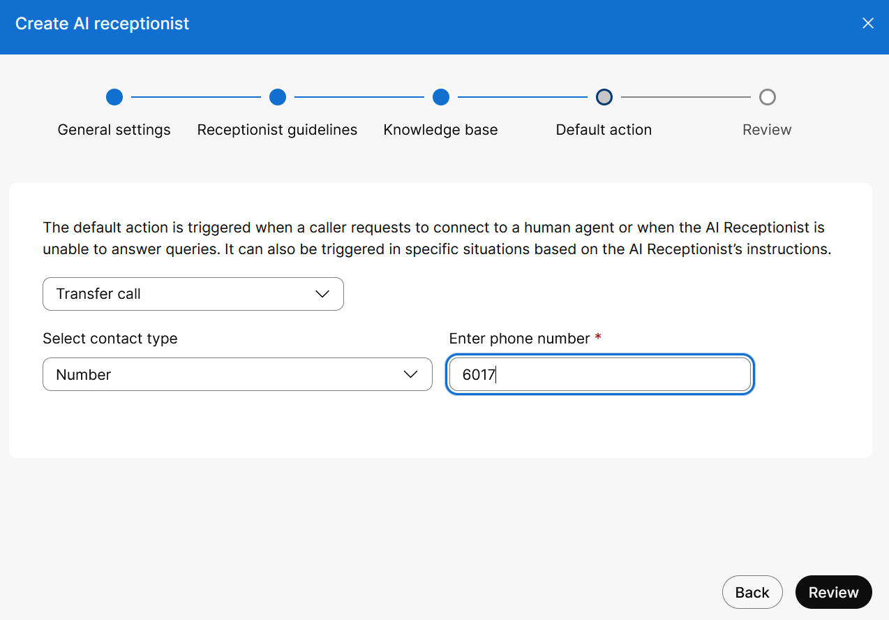{ .lab-screenshot width="864" loading="lazy" }

2. Click ‘<em>Review</em>’

### Review and Creation { #review-and-creation }

1. On the <strong>Review</strong> page, carefully verify all configured settings across the General Settings, Receptionist guidelines, Knowledge base, and Default action tabs.


2. If any changes are needed, you can navigate back to the appropriate step and update them.


3. Once satisfied, click ‘<em>Create</em>’ to finish creating the AI Receptionist.

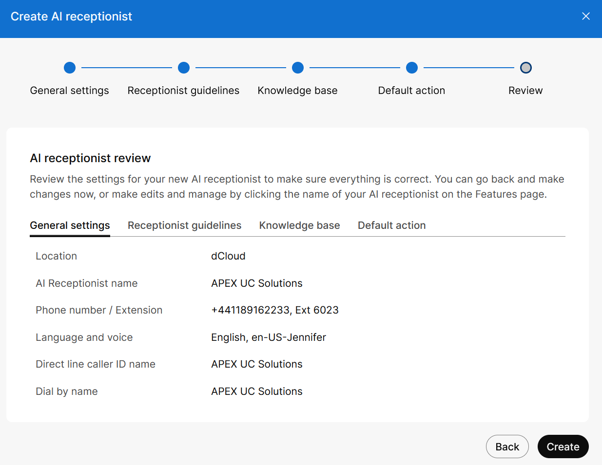{ .lab-screenshot width="864" loading="lazy" }

4. You will see the message “<strong>AI Receptionist was created successfully</strong>”. Click ‘<em>Close</em>’. You will add Intents later in the lab after you create the Customer Assist queues.

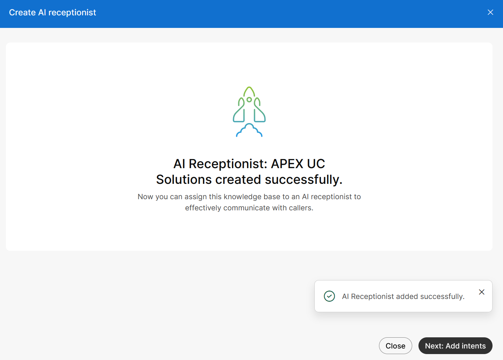{ .lab-screenshot width="864" loading="lazy" }

<strong>You are done configuring AI Receptionist. You will test and verify it later in the lab.</strong>
