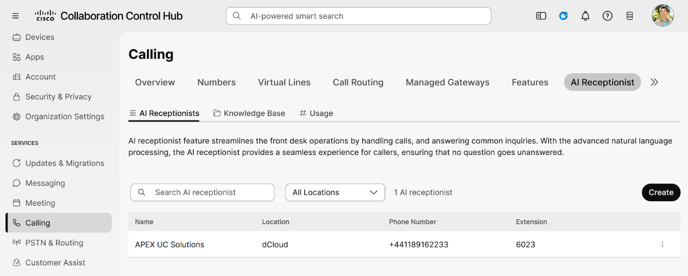
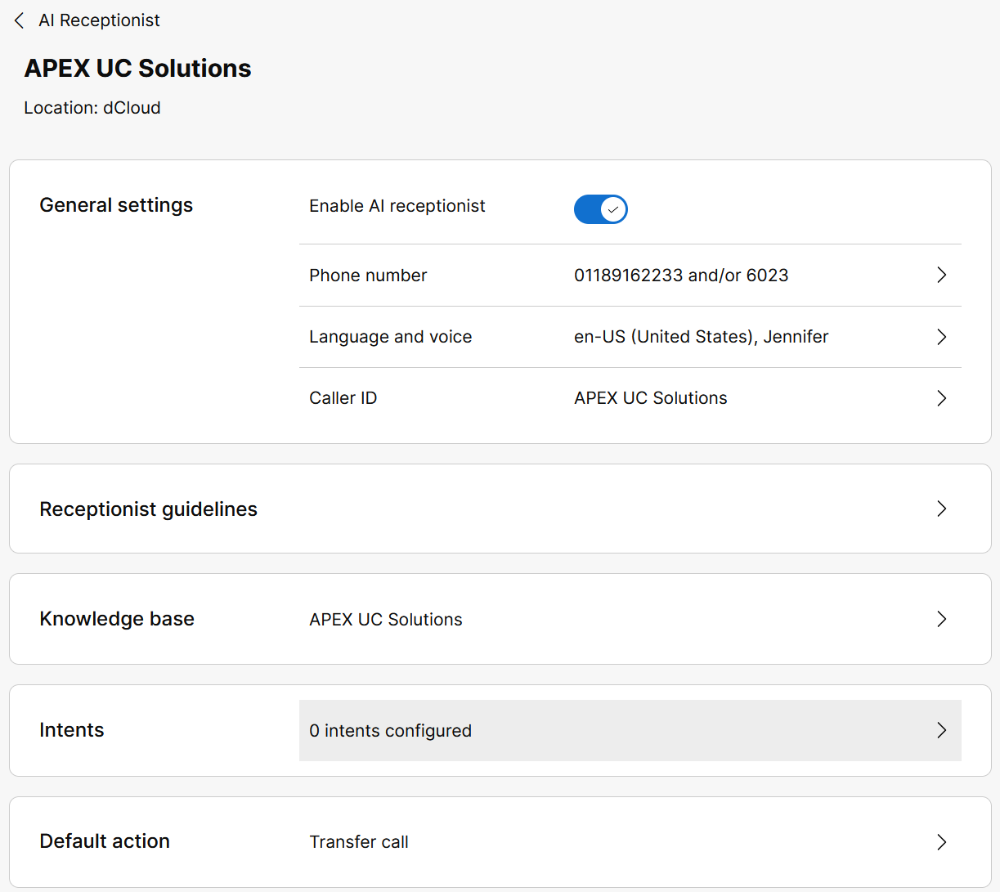
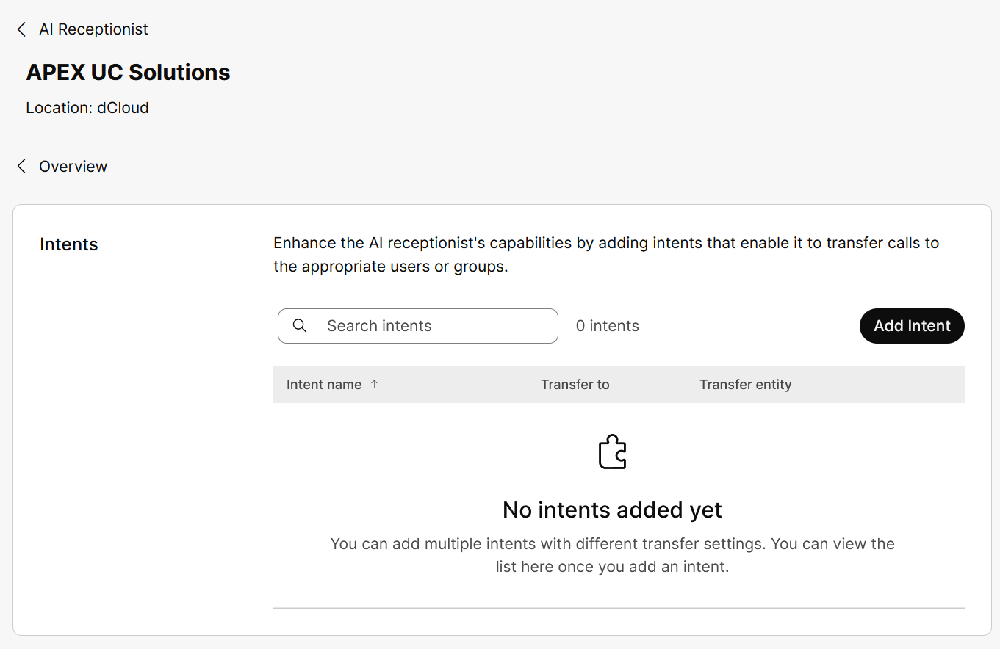
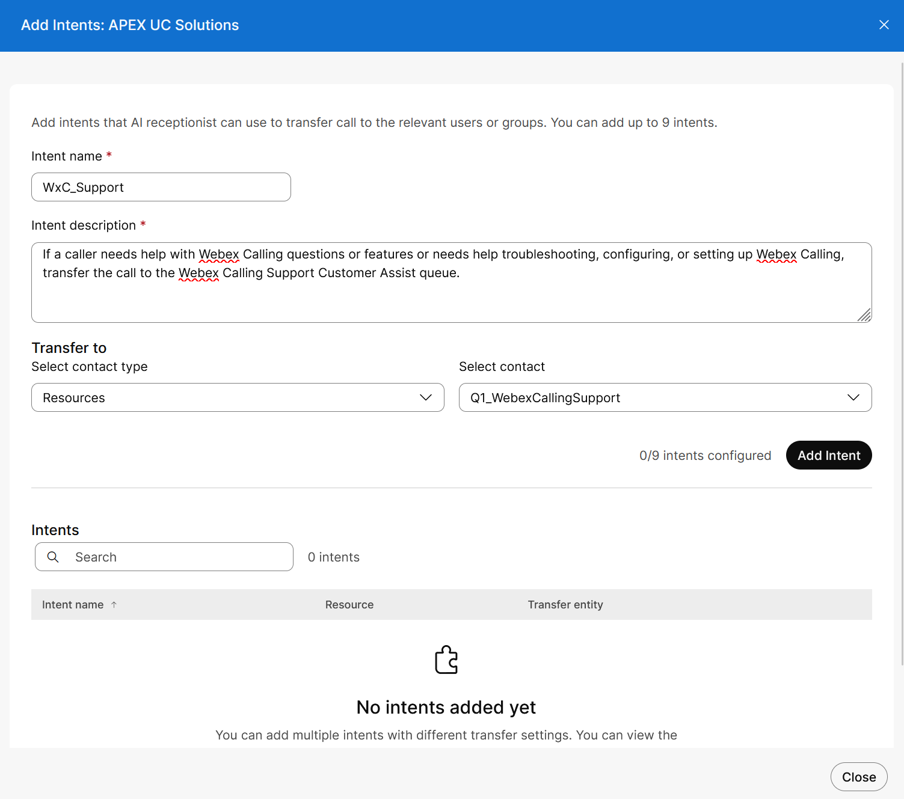
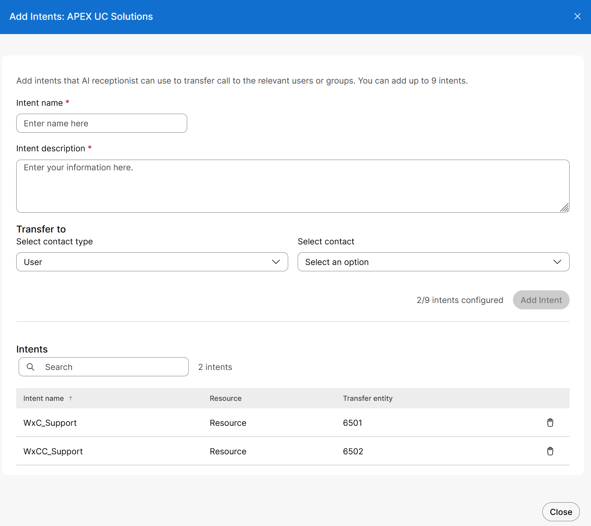
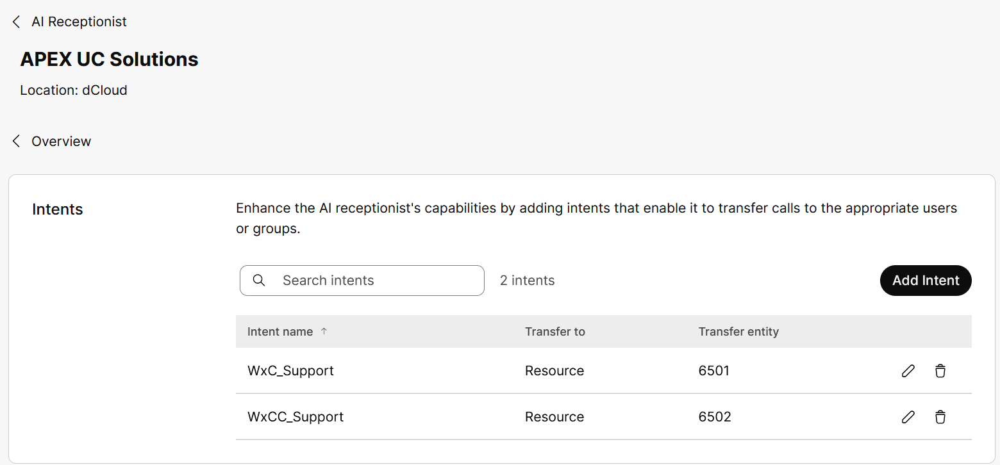
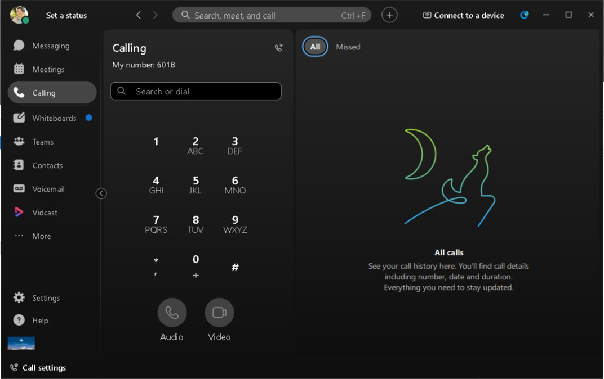
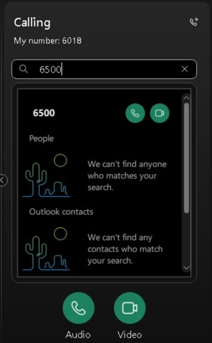
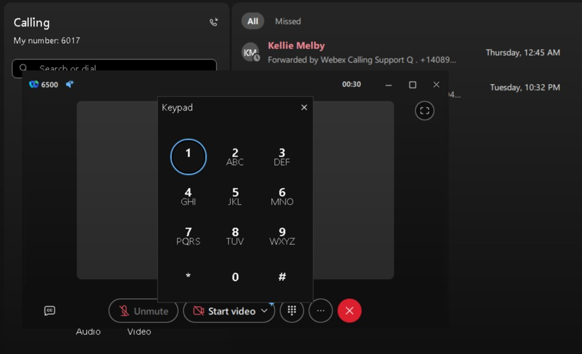

# Task 4: AI Receptionist Intent-Based Routing \[10 minutes\] { #task-4-ai-receptionist-intent-based-routing-10-minutes }

!!! info "Queue prerequisite"

    This task uses `Q1_WebexCallingSupport` and `Q2_WebexContactCenterSupport`. Confirm these queues and their agent/supervisor assignments are available in your assigned lab before continuing. Queue creation steps are not included in this guide.

You will now configure the AI Receptionist to send calls to the Customer Assist queues. For each queue you will define the criteria that the AI Receptionist will use to determine when to route the call to it.

## Step 1: Add Intentions { #step-1-add-intentions }

Intents are used to transfer calls to a defined destination (User, Resource, Organization contact, or Number). In scenarios when a caller is asking for specific information or help that the AI Receptionist cannot handle, you can use intents to send their call to a human, queue/agent or voicemail for additional assistance.

!!! note

    You can define a maximum of 9 intents.

    There is also the Default Action created for each AI Receptionist, which gives a total of 10 intents for transferring calls from the AI Receptionist to a user, resource (e.g. Customer Assist queue), Org contact or number.

In this lab you will add 2 intents for your <strong>APEX UC Solutions</strong> AI Receptionist:

1) Transfer calls to the <strong>Webex Calling Support Customer Assist queue</strong> when a caller needs help with Webex Calling questions or issues

2) Transfer calls to the <strong>Webex Contact Center Support Customer Assist queue</strong> when a caller needs help with Webex Contact Center questions or issues.

1. Under the <strong>SERVICES</strong> page, click on ‘<em>AI Receptionist \> APEX UC Solutions</em>’. On the <strong>AI Receptionist</strong> page, click on the ‘<em>APEX UC Solutions</em>’ AI Receptionist.

{ .lab-screenshot width="864" loading="lazy" }

2. On the APEX UC Solutions AI Receptionist, click on ‘<em>0 intents configured \></em>’ in the <strong>Intents</strong> section.

    { .lab-screenshot width="864" loading="lazy" }

3. On the <strong>Intents</strong> page, click on ‘<em>Add Intent</em>’.

{ .lab-screenshot width="864" loading="lazy" }

4. On the <strong>Add Intentions</strong>: <strong>APEX UC Solutions</strong> page, use the following settings to configure the first intent.

These settings are also in the <strong>AI Receptionist Config.txt</strong> file in the <strong>WxC AIR Files</strong> folder <strong>on Workstation 1’s desktop</strong>. You can use this file to copy/paste the information into the configuration.

<strong>Intent name</strong> = WxC\_Support

<strong>Intent Description</strong> = If a caller needs help with Webex Calling questions or features or needs help troubleshooting, configuring, or setting up Webex Calling, transfer the call to the Webex Calling Support Customer Assist queue.

<strong>Transfer to</strong> =

<strong>Contact Type</strong> = Resource

<strong>Contact</strong> = Q1\_WebexCallingSupport

5. Click ‘<em>Add Intent</em>’

{ .lab-screenshot width="864" loading="lazy" }

6. You will repeat this process to add a 2nd intent. Use the following settings to configure the second intent.

These settings are also in the <strong>AI Receptionist Config.txt</strong> file in the <strong>WxC AIR Files</strong> folder <strong>on Workstation 1’s desktop</strong>. You can use this file to copy/paste the information into the configuration.

<strong>Intent name</strong> = WxCC\_Support

<strong>Intent Description</strong> = If a caller needs help with Webex Contact Center questions or features or needs help troubleshooting, configuring, or setting up Webex Contact Center, transfer the call to the Webex Contact Center Support Customer Assist queue.

<strong>Transfer to</strong> =

<strong>Contact Type</strong> = Resource

<strong>Contact</strong> = Q2\_WebexContactCenterSupport

7. Click ‘<em>Add Intent</em>’

8. You should see both intents listed on the <strong>Add Intents: APEX UC Solutions</strong> page. After verifying both intents are listed, click ‘<em>Close</em>’.

{ .lab-screenshot width="864" loading="lazy" }

9. On the <strong>Intents</strong> page for the <strong>APEX UC Solutions</strong> AI Receptionist, you will see the 2 newly added intents

    { .lab-screenshot width="864" loading="lazy" }

## Call-in Options \[2 minutes\] { #call-in-options-2-minutes }

!!! note

    <strong>For the remaining tasks that require calls to test the features, you have two options:</strong>

    1. <strong>From your mobile phone dial the AI Receptionist’s E.164 number that you configured for it (Recommended)</strong>

    2. <strong>From the Webex App on your laptop or mobile phone (logged in as Charles Holland) dial the extension you configured for the AI Receptionist or Auto Attendant</strong>

    <strong>The lab guide will use Option #1 (dial the AI Receptionist from a mobile phone) for the remaining verification tests.</strong>

### Option 1: Using Mobile Phone { #option-1-using-mobile-phone }

1. From your mobile phone, dial the E.164 number configured for the AI Receptionist

For example, on your mobile phone dial <strong>+44118916223</strong>

- You can find your lab’s phone number in the “<strong>Lab\_info.txt</strong>” file on <strong>Workstation 1’s</strong> desktop

    - External Caller number is for the AI Receptionist

<strong>Your numbers WILL BE different</strong>

2. You will hear the AI Receptionist greeting

3. Use natural language and ask the AI Receptionist questions or ask for specific help.

### Option 2: Using Webex App { #option-2-using-webex-app }

1. Log into the Webex App on your laptop or smartphone as <strong>Charles Holland</strong>.

2. Click on the “<em>Calling</em>” page in the menu on the left side of the Webex App. You can use the “<em>Seach or dial</em>” window or keypad to dial an extension and place the call.

Dial the Auto Attendant (<strong>6500</strong>) for the <strong>Support Desk IVR</strong> or dial the AI Receptionist (<strong>6023</strong>).

- <strong>ALL</strong> labs use the same extensions for the Auto Attendant and AI Receptionist

{ .lab-screenshot width="864" loading="lazy" }

3. Press the “<em>handset</em>” icon to initiate the call.

| <strong>Type 6500 or 6023 in “Search or dial”</strong> | <strong>Dial 6500 or 6023 on the “Dialer pad”</strong> |
| --- | --- |

{ .lab-screenshot width="347" loading="lazy" }

4. You will either hear the Auto Attendant greeting or AI Receptionist greeting, depending on which extension you dialed.

5. { .lab-icon width="34" loading="lazy" }In the call window click on the dialer pad icon ( ) and use the keypad to enter DTMF digits for the Auto Attendant.

    { .lab-screenshot width="864" loading="lazy" }

<strong>This task is now completed. Proceed to the next task.</strong>
