# Task 5: Log Test Users into Webex App \[10 minutes\] { #task-5-log-test-users-into-webex-app-10-minutes }

Next you will need to log into the Webex App for the caller (Charles), both Agents (Anita and Kellie) and the Supervisor (Taylor). Use the following table to see which device to use for each user.

| User | Queue Name | Role | Workstation to use |
| --- | --- | --- | --- |
| Charles Holland | n/a | Caller / Customer | Your laptop or mobile phone |
| Anita Perez | Q1\_WebexCallingSupport | Agent | Workstation 2 |
| Kellie Melby | Q1\_WebexCallingSupport | Agent | Workstation 3 |
| Taylor Bard | Q1\_WebexCallingSupport Q2\_WebexContactCenterSupport | Supervisor | Workstation 4 |

- User IDs and Passwords can be found in [Task 1: Step 3 – Login Credentials for Control Hub and Webex App](01-access-the-lab.md#step-3-login-credential-for-control-hub-and-webex-app).

## Step 1: Login to Webex App as Charles Holland { #step-1-login-to-webex-app-as-charles-holland }

<strong>It is recommended to use your mobile phone to make calls to the AI Receptionist</strong>

If you would like to use <strong>Charles Holland</strong> to simulate a caller, then you will need to log into the Webex App as Charles <strong>on your own laptop or mobile phone</strong>.

<em><u>Note</u>: Charles Holland is <strong>NOT</strong> configured for any Webex Calling Customer Assist features and <strong>WILL NOT</strong> have the Customer Assist option available in the Webex App</em>

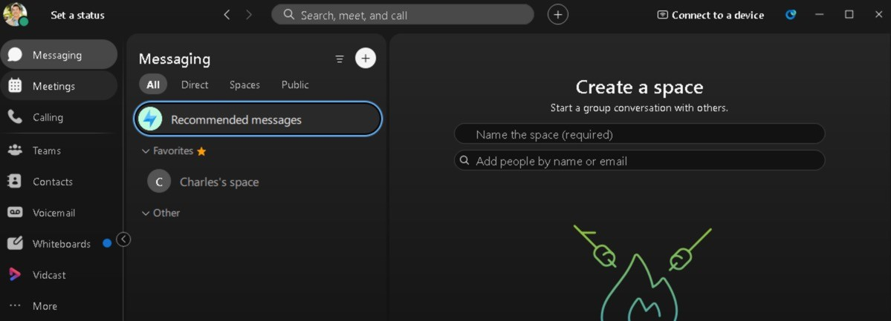{ .lab-screenshot width="864" loading="lazy" }

!!! note

    <u>Note</u>: Avoid using the Workstation 1 for Charles Holland as it lacks microphone input and will interfere with DTMF digit recognition with the Auto Attendant.

The following steps are for logging into the Webex App on your laptop:

1. 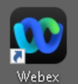{ .lab-icon width="47" loading="lazy" }On your laptop launch the Webex App.

2. If you are prompted to review the Webex App’s disclaimers, click on “Agree”.

    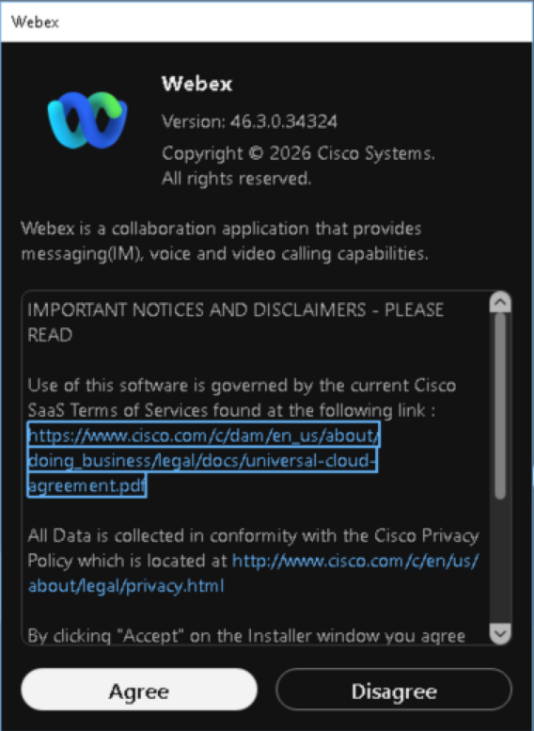{ .lab-screenshot width="534" loading="lazy" }

3. Click the “<em>Sign in</em>” button and login with Charles Hollands’ Webex credentials:

- **User ID:** use the assigned account for this user from your private session details.

- **Password:** use the password supplied privately for your assigned session.

!!! note

    <em><u>Note</u>: Domain and Webex password (for all users) is in the “<strong>Lab\_Info.txt</strong>” file on Workstation 1’s desktop.</em>

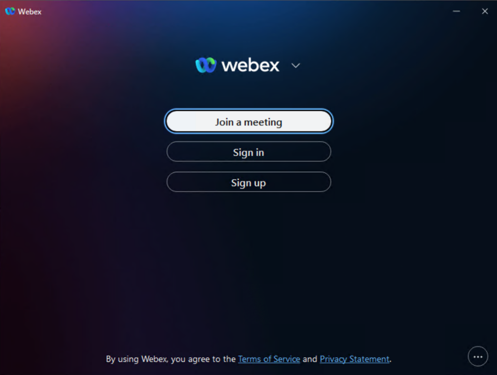{ .lab-screenshot width="864" loading="lazy" }

4. Click “<em>Ok</em>” to acknowledge Emergency Calling Notification warning.

    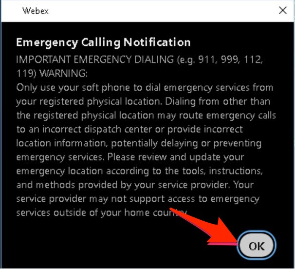{ .lab-screenshot width="285" loading="lazy" }

## Step 2: Login to Webex App as Anita Perez (Agent) { #step-2-login-to-webex-app-as-anita-perez-agent }

Log into the <strong>Webex App</strong> as <strong>Anita Perez</strong> on <strong>Workstation 2</strong>.

1. In your dCloud lab browser tab open a new “<strong>Web RDP</strong>” session to <strong>Workstation 2</strong> by clicking on “<em>Workstation 2</em>” and then clicking on "<em>Web RDP</em>” under the <strong>Remote Access</strong> section in the left panel. This will open a new browser tab to Workstation 2’s desktop.

2. In the new browser tab, click on the <strong>Webex App</strong> icon on the desktop and “<em>Sign in</em>” with <strong>Anita Perez’s</strong> Webex credentials:

- **User ID:** use the assigned account for this user from your private session details.

- **Password:** use the password supplied privately for your assigned session.

!!! note

    <em><u>Note</u>: Domain and Webex password (for all users) is in the “<strong>Lab\_Info.txt</strong>” file on Workstation 1’s desktop.</em>

{ .lab-screenshot width="864" loading="lazy" }

3. Once logged in make sure you have the latest version running. Click on the ‘<em>User Avatar (top left of app) \> Help \> About</em>’

4. In the pop-up window click ‘<em>Check for updates</em>’. If there is an update, click ‘<em>Get update</em>’ to update to the latest version.

    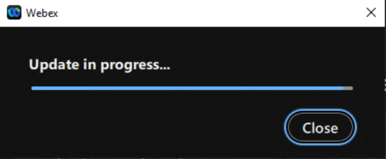{ .lab-screenshot width="639" loading="lazy" }

    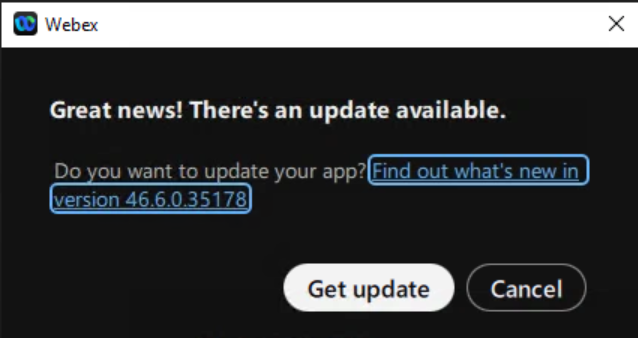{ .lab-screenshot width="638" loading="lazy" }

    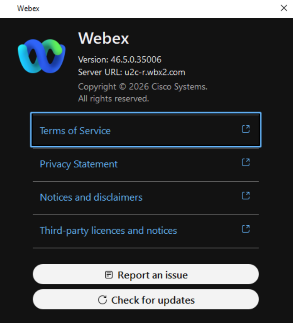{ .lab-screenshot width="586" loading="lazy" }

5. Once the update finishes downloading, click ‘<em>Restart now</em>’ to install and run the new version.

    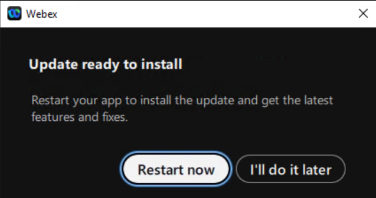{ .lab-screenshot width="637" loading="lazy" }

6. Once you are logged in you will notice <strong>Anita Perez</strong> has the <strong>Customer Assist</strong> page in the <strong>Webex App</strong>. This is because she has a Customer Assist license assigned to her and you configured her as an Agent.

    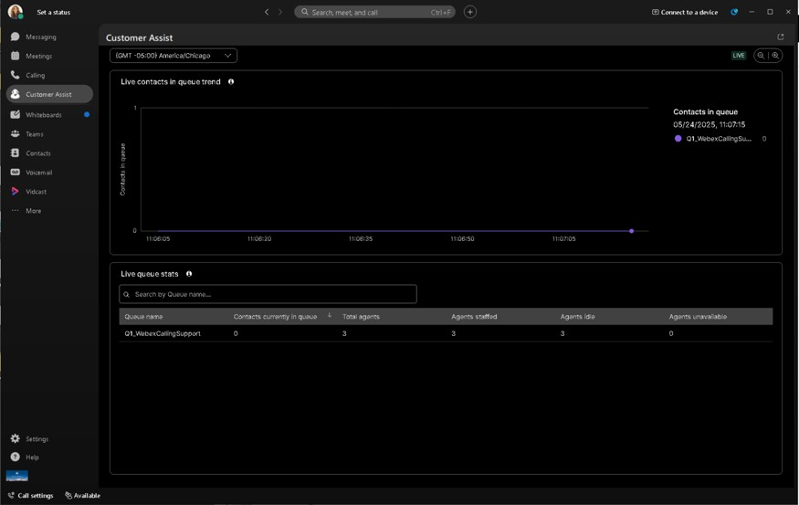{ .lab-screenshot width="864" loading="lazy" }

## Step 3: Login to Webex App as Kellie Melby (Agent) { #step-3-login-to-webex-app-as-kellie-melby-agent }

Log into the Webex App as <strong>Kellie Melby</strong> on <strong>Workstation 3</strong>.

Repeat steps 1-5 from <strong>STEP 2: Login to Webex App as Anita Perez (Agent)</strong> above but on <strong>Workstation 3</strong>.

1. “<em>Sign in</em>” with Kellie Melby’s Webex credentials:

- **User ID:** use the assigned account for this user from your private session details.

- **Password:** use the password supplied privately for your assigned session.

!!! note

    <em><u>Note</u>: Domain and Webex password (for all users) is in the “<strong>Lab\_Info.txt</strong>” file on Workstation 1’s desktop.</em>

2. Once logged in you will notice <strong>Kellie Melby</strong> has the <strong>Customer Assist</strong> page in the <strong>Webex App</strong> just like Anita. This is because she has a Customer Assist license assigned to her and you configured her as an Agent.

## Step 4: Login to Webex App as Taylor Bard (Supervisor) { #step-4-login-to-webex-app-as-taylor-bard-supervisor }

Log into the Webex App as <strong>Taylor Bard</strong> on <strong>Workstation 4</strong>.

Repeat steps 1-5 from <strong>STEP 2: Login to Webex App as Anita Perez (Agent)</strong> above but on <strong>Workstation 4</strong>.

1. “<em>Sign in</em>” with Taylor Bard’s Webex credentials:

- **User ID:** use the assigned account for this user from your private session details.

- **Password:** use the password supplied privately for your assigned session.

!!! note

    <em><u>Note</u>: Domain and Webex password (for all users) is in the “<strong>Lab\_Info.txt</strong>” file on Workstation 1’s desktop.</em>

2. Close any open Windows once you logged onto the Workstation.

3. Once logged in you will notice <strong>Taylor Bard</strong> has the <strong>Customer Assist</strong> page in the <strong>Webex App</strong> just like Anita and Kellie. This is because he has a Customer Assist license assigned to him and you configured him as both a Supervisor and Agent.

    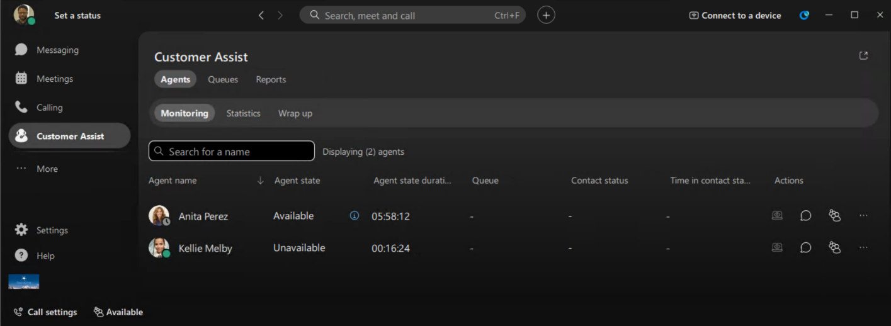{ .lab-screenshot width="864" loading="lazy" }

<strong>This task is now completed. Proceed to the next task.</strong>
